<div align="center">

# PetStore 全平台宠物商城

基于 Vue 3、Spring Boot 与 uni-app 构建的宠物用品电商系统，包含 PC Web、管理后台和 Android 移动端，三端共用同一套 REST API。

</div>

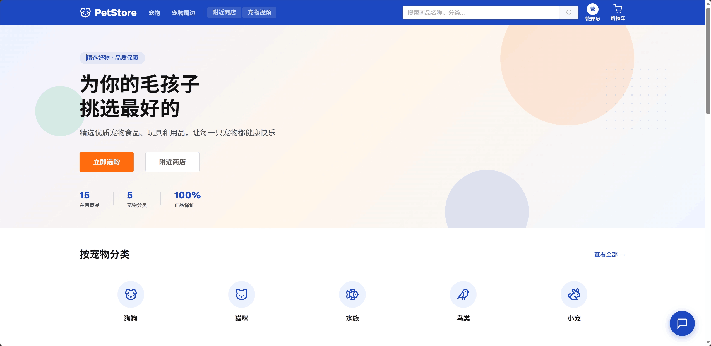

## 项目概览

PetStore 是一个团队课程实训项目，围绕宠物与宠物用品交易场景，实现从商品浏览、购物车、下单支付到发货、退款、收货和评价的完整业务流程。项目同时接入高德地图、宠物视频和 DeepSeek API，用于附近门店查询、内容展示和基于商品上下文的 AI 推荐。

### 核心亮点

- **三端协同**：PC 用户端、管理后台和 uni-app 移动端共享 Spring Boot REST API。
- **电商业务闭环**：覆盖商品筛选、库存校验、购物车、订单状态流转、退款审核和评价。
- **AI 商品推荐**：后端注入商品上下文并调用 DeepSeek，前端解析推荐标记并展示商品卡片。
- **地图与内容场景**：集成高德地图附近门店查询，并支持宠物视频及关联商品展示。
- **多端交付**：支持 Web/H5 运行、Android APK 构建，以及前端静态资源整合到 Spring Boot。

## 功能展示

### PC Web

| 商品筛选 | 商品详情 |
|---|---|
| 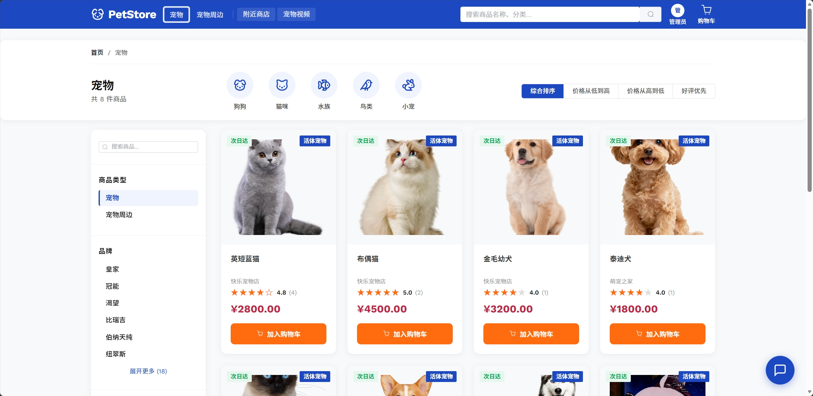 | 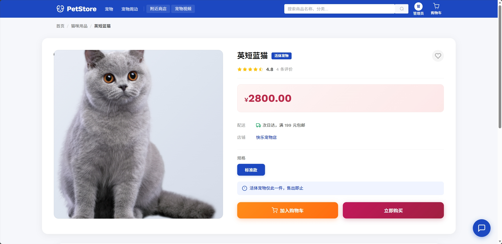 |

### AI 智能助手

后端将商品列表注入模型上下文，AI 返回回答和推荐商品标记，前端将标记映射为可查看、可加购的商品卡片。

<p align="center">
  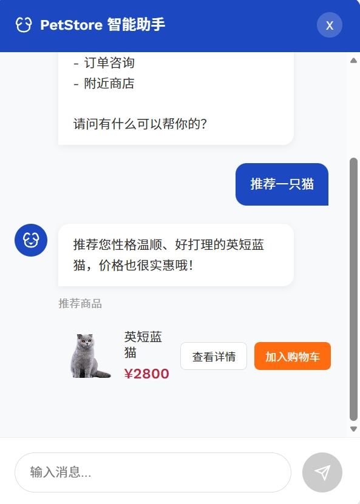
</p>

### 附近门店与宠物视频

| 高德地图附近门店 | 宠物视频 |
|---|---|
| 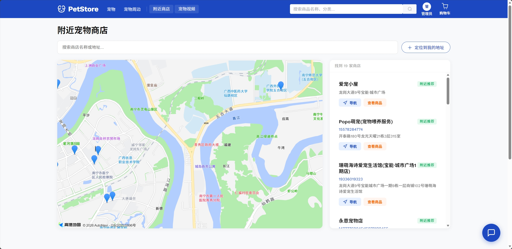 | 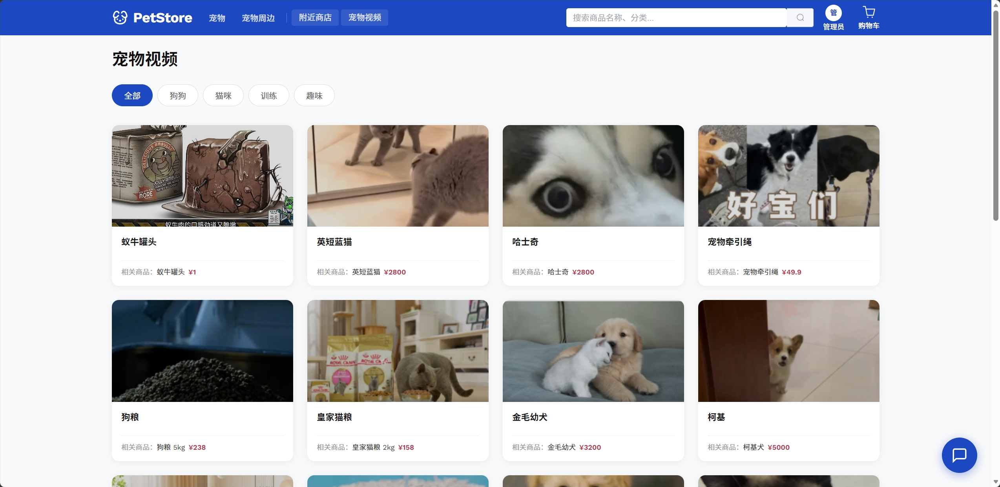 |

### Android 移动端

<p align="center">
  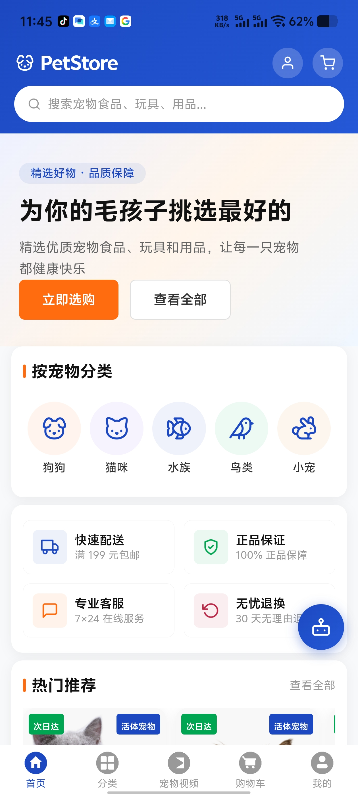
  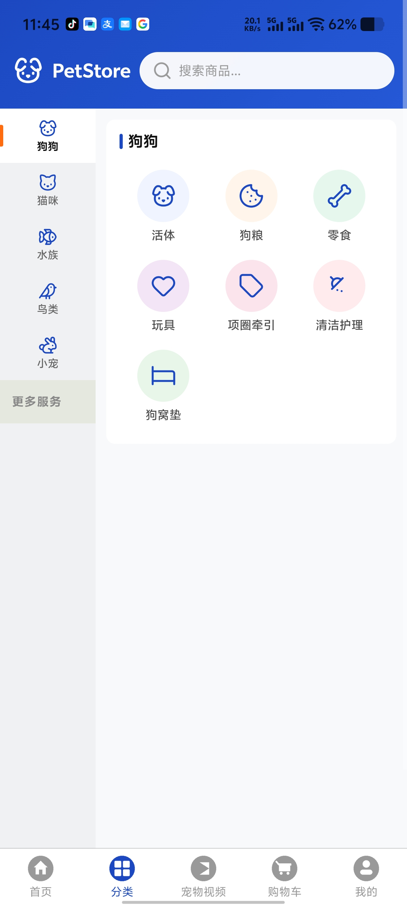
  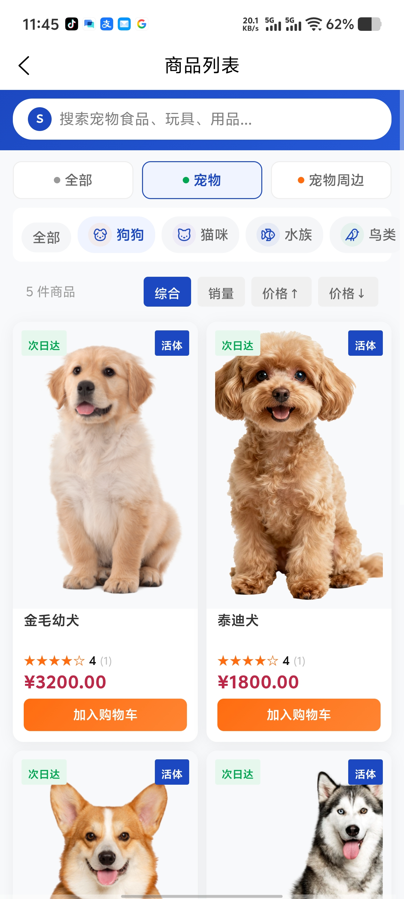
  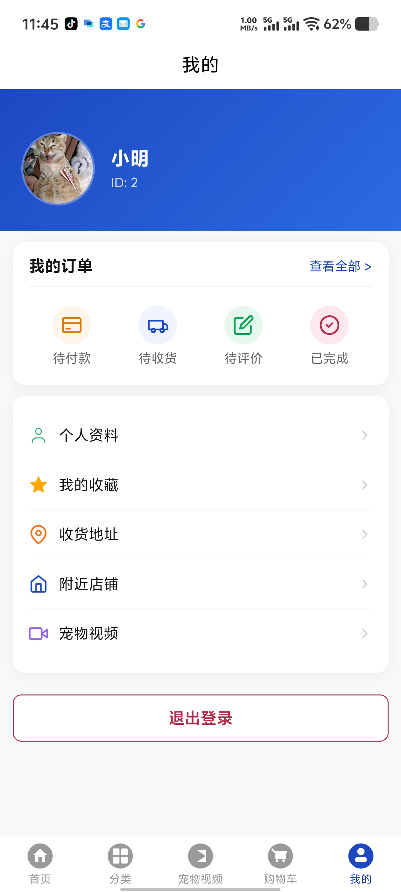
</p>

## 系统架构

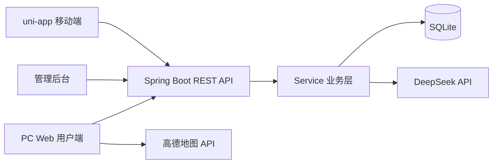

三端通过统一接口访问后端。后端采用 Controller、Service、Repository 分层，使用统一的 `Result<T>` 响应结构；SQLite 保存用户、商品、购物车、订单、地址、评价、商店和视频等业务数据。

## 技术栈

| 模块 | 技术 |
|---|---|
| PC Web | Vue 3、Vite、Element Plus、Pinia、Vue Router、Axios |
| 移动端 | uni-app、Vue 3、HBuilderX |
| 后端 | Java 8、Spring Boot 2.7、Spring Data JPA、RESTful API |
| 数据库 | SQLite、外键约束、初始化脚本 |
| AI | DeepSeek API（OpenAI 兼容格式） |
| 地图 | 高德地图 JS API 2.0 |
| 构建与部署 | Maven、npm、Nginx、Windows 批处理脚本 |

## 核心业务流程

### 订单流程

```text
浏览商品 -> 加入购物车 -> 库存校验 -> 提交订单 -> 模拟支付
         -> 管理员发货 -> 用户确认收货 -> 评价
```

退款申请会记录原订单状态。管理员审核通过后恢复库存并完成退款；审核拒绝时回退至申请前状态。

### AI 推荐流程

```text
用户提问
  -> 后端读取商品数据并构建上下文
  -> 调用 DeepSeek API
  -> 返回回答与推荐商品标记
  -> 前端解析商品 ID 并展示推荐卡片
```

## 功能模块

| 客户端 | 主要功能 |
|---|---|
| PC 用户端 | 首页、分类筛选、商品详情、收藏、购物车、结算、订单、退款、评价、个人资料、地址、附近门店、宠物视频、AI 助手 |
| 管理后台 | 数据概览、商品管理、订单发货与退款审核、用户管理、视频与封面管理 |
| 移动端 | 首页、分类、商品列表、购物车、订单、个人中心、地址、收藏、视频、AI 助手 |

## 项目结构

```text
petStore/
|-- petstore-frontend/        # Vue 3 PC 用户端与管理后台
|   `-- src/
|       |-- api/              # API 封装
|       |-- components/       # 公共组件
|       |-- router/           # 路由与权限守卫
|       |-- stores/           # Pinia 状态管理
|       `-- views/            # 用户端与管理端页面
|-- petstore-mobile/          # uni-app Android/H5 移动端
|   |-- pages/
|   |-- services/
|   `-- static/
|-- petstore-server/          # Spring Boot REST API
|   `-- src/main/java/com/petstore/
|       |-- controller/
|       |-- service/
|       |-- repository/
|       |-- entity/
|       |-- dto/
|       `-- config/
|-- 发行版/                    # 整合后的后端与 Android APK
|-- build-and-deploy.bat      # 构建前端并整合至后端静态资源
|-- start.bat                 # Windows 开发环境一键启动
`-- stop.bat                  # 停止本地服务
```

## 本地运行

### 环境要求

- JDK 8+
- Maven 3.6+
- Node.js 20+
- HBuilderX（仅移动端开发需要）

### 1. 启动后端

AI 功能需要在本地设置 DeepSeek Key。请使用环境变量，不要把真实 Key 提交到仓库。

```powershell
$env:AI_API_KEY="your-deepseek-api-key"
cd petstore-server
mvn spring-boot:run
```

后端默认运行于 `http://localhost:8080`，首次启动时会自动建表并导入演示数据。

### 2. 启动 PC Web

```bash
cd petstore-frontend
npm install
npm run dev
```

浏览器访问 `http://localhost:5173`。Vite 会将 `/api` 请求代理到后端 `8080` 端口。

### 3. 启动移动端

使用 HBuilderX 打开 `petstore-mobile/`，可运行到浏览器或 Android 设备。

### Windows 一键启动

```bat
start.bat
```

该脚本会依次启动 Spring Boot 后端与 Vue 3 开发服务器；使用 `stop.bat` 停止服务。

## 构建与发布

执行以下脚本构建 PC Web，并将 `dist` 内容整合到 Spring Boot 静态资源目录：

```bat
build-and-deploy.bat
```

构建完成后启动后端，即可通过 `http://localhost:8080` 访问整合版本。Android APK 和课程交付文件位于 [`发行版/`](./发行版/)。

## 演示账号

以下账号仅用于本地演示，部署到公网前请修改密码。

| 角色 | 账号 | 密码 |
|---|---|---|
| 管理员 | `admin` | `admin123` |
| 普通用户 | `user1` | `123456` |

## 相关文档

- [项目技术与业务说明](./项目汇报.md)
- [部署注意事项](./部署注意.md)
- [发行版说明](./发行版/README.md)
